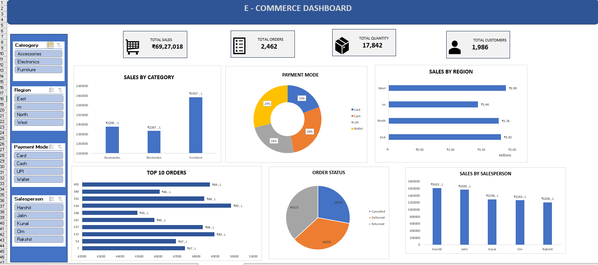

# Data-Analytics-portfolio
My Data Analytics portfolio | Excel | SQL | Power BI | Python
# Sales Dashboard
## Dashboard Preview

## Project Overview
This interactive Sales Dashboard was created using Microsoft Excel.
## Tools Used
- Microsoft Excel
- Pivot Table
- Pivot Charts
- Conditional Formatting
  ## KPIs
- Total Sales
- Total Orders
- Total Quantity
- Total Customers
## Dashboard Features
- Sales by Category
- Sales by Region
- Sales by Salesperson
- Payment Mode Analysis
- Order Status Analysis
- Top 10 Orders
- Interactive Slicers
